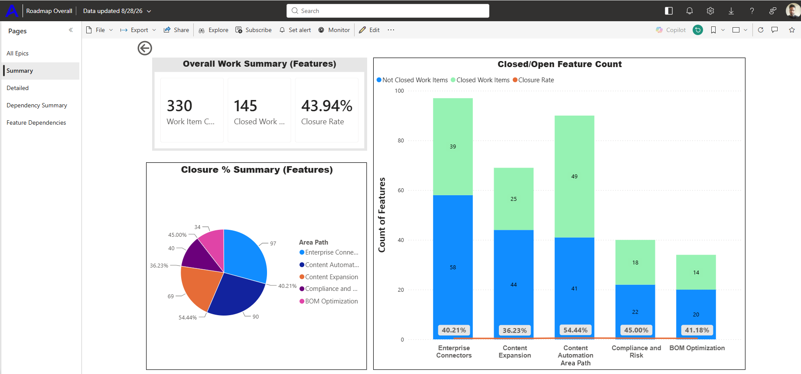

# Delivery Progress Summary Dashboard

## Purpose

This Power BI dashboard provides an overall view of feature delivery progress across multiple teams and workstreams.

## Dashboard Screenshot

## Audience

- Senior leadership
- Delivery managers
- Product managers
- Engineering leads

## What the Dashboard Shows

- Total feature count
- Completed feature count
- Overall closure rate
- Open and closed features by team
- Team-level completion rates
- Distribution of work across delivery areas

## Delivery Problem Addressed

Leadership needed a consolidated view of feature progress across multiple teams. This dashboard provides a single view of completion levels and highlights areas requiring additional attention.

## My Contribution

- Identified the reporting requirements
- Defined the progress and closure measures
- Designed the summary dashboard structure
- Consolidated delivery information across teams
- Used the dashboard to support progress reviews and leadership discussions

## How Leadership Can Use It

- Monitor overall delivery progress and closure trends
- Compare performance across teams and delivery areas
- Identify teams or workstreams requiring attention
- Support prioritisation and delivery-review discussions
- Track whether delivery is progressing towards planned outcomes

## Data Privacy

All names, metrics and delivery information displayed in this portfolio example are fictional or sanitized. No confidential company, customer or employee data is included.
