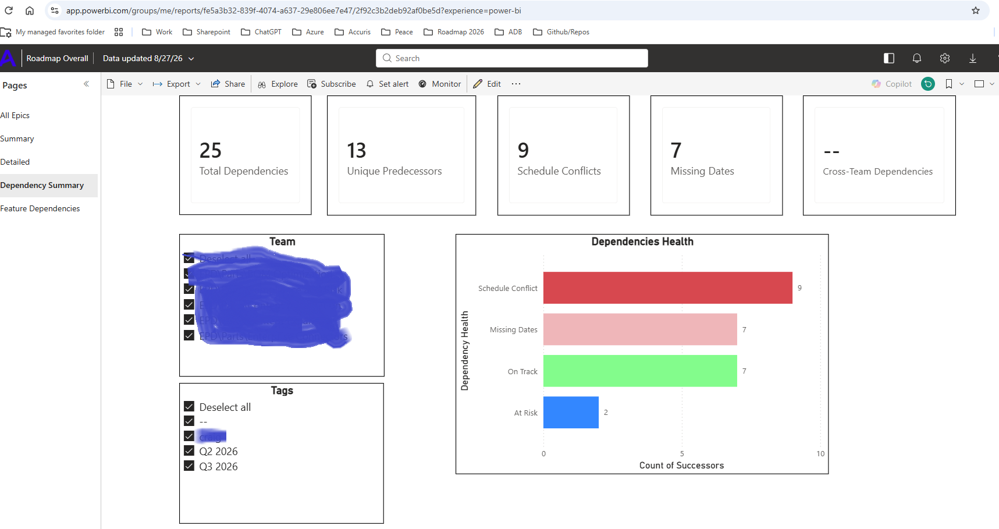
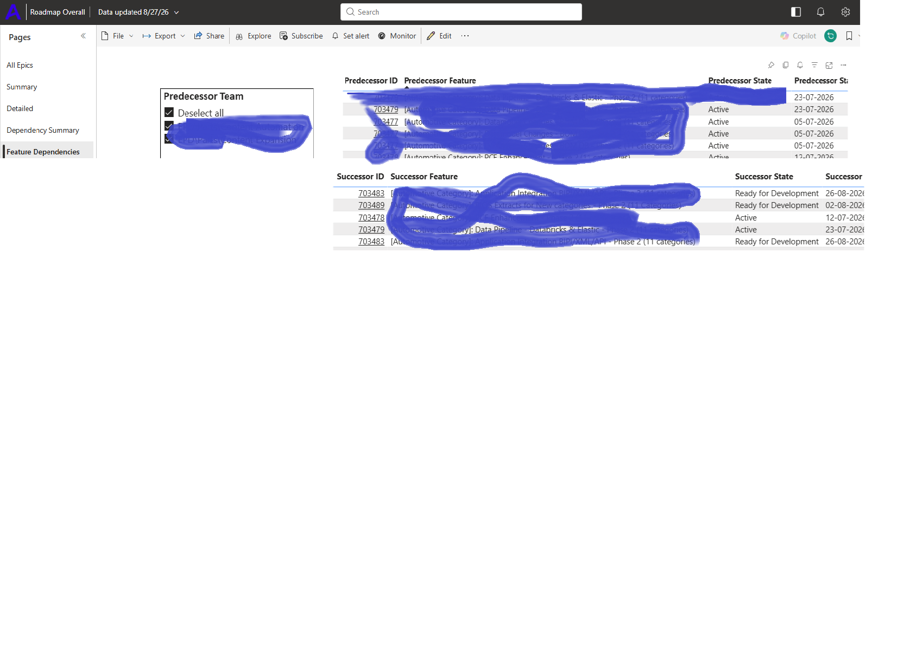

# Dependency Management Dashboard

## Purpose

This Power BI dashboard provides visibility into dependencies across
teams, features and delivery milestones.

## Dashboard Screenshots

### Dependency Summary

### Dependency Details

## Audience

- Senior leadership
- Delivery managers
- Product managers
- Engineering leads

## What the dashboard shows

- Total open dependencies
- Overdue dependencies
- Dependencies by status
- Dependencies by team
- Features affected by dependencies
- Dependency owners and target dates

## Delivery problem addressed

Dependencies were tracked across different teams and work items,
making it difficult to identify blockers and ownership.

This dashboard creates a consolidated view so that delivery risks can
be identified and escalated early.

## My contribution

- Identified the reporting requirements
- Defined the dependency status and risk rules
- Designed the dashboard structure
- Created the Power BI report
- Established the review and escalation process

## Decisions supported

The dashboard helps delivery leadership:

- Identify dependencies affecting committed timelines
- Escalate overdue dependencies
- Confirm ownership
- Prioritize cross-team discussions
- Assess the impact on features and releases

## Tools used

Power BI, Power Query and Azure DevOps data
